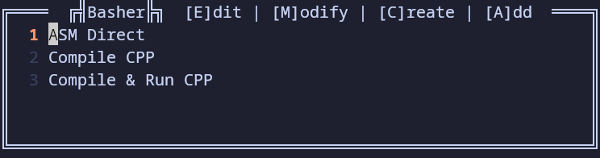

# Basher
Make and Run Bash Scripts in NeoVim easier

## Usage

I think you should at least have a shortcut to toggle the Main Window as you can do everything from this.
The toggle function:

    require("Basher").toggleMainWin()

When inside the Main Window you can Run / Add / Create / Modify scripts.

You run a script by either hitting the line number key or enter on the selected. i.e hit "2" to run the script on line two.

You can reorder the scripts in this menu by using <Shift-U> and <Shift-D>

There is two functions that'll let you run the scripts without openning the Main Window:

    require("Basher").runScript(**scriptNumber**)
    require("Basher").runScriptFromAlias(**scriptAlias**)

The script number will be the line number it's on.
The scripts will stay in the same order you set them in the Main Window.

I personally like to set something like:

    vim.keymap.set({ "n", "i" }, "<C-1>", '<cmd>:lua require("Basher").runScript(1)<CR>')
    vim.keymap.set({ "n", "i" }, "<C-2>", '<cmd>:lua require("Basher").runScript(2)<CR>')
    vim.keymap.set({ "n", "i" }, "<C-3>", '<cmd>:lua require("Basher").runScript(3)<CR>')
    vim.keymap.set({ "n", "i" }, "<C-4>", '<cmd>:lua require("Basher").runScript(4)<CR>')
This lets me run multiple scripts without specifing with an Alias.

When you want to add a script that already exists you can go thru the Main Win or use:

    require("Basher").addScript()
    require("Basher").addCurrentScript(**openModifyWindowBool**)

addScript will bring up an empty Modify Window for you to specify the file.
addCurrentScript will add the current buffer if it's a .sh file.

You can modify scripts to have an Alias or have additional arguments added to the end of the script call.

If you want to remove scripts from Basher, you must open the Modify Window for the script you wish to remove.

### Creating scripts

When you are creating a script, you must specify a template.

There is a "basic" template that is included with Basher, but if you want to add your own you can use:

    require("Basher").addCurrentScriptAsTemplate()

This will take the currently open .sh file and save a copy of it to the Templates folder (Data/Basher/Templates).
This **WILL NOT** change the current buffer to the new file.

If you want to edit a template file, you can open the Create Menu and Edit from there.

If you modify the Templates, it's a good idea to:

    require("Basher").refreshTemplateList()

## Install

Using Lazy:

    { 'rienovie/Basher', opts = {} },

## Config

There are a few options for config and they are just used like this:

    { 'rienovie/Basher', opts = { funOnStart = true, pathMaxDirs = 2 }},

Here is the list of all the options:

    --Prints fun message whenever main window opens
    funOnStart = bool (default = true)

    --When creating script automatically make executable
    autoMakeExec = bool (default = true)

    --Max amount of prior directories shown when no Alias given
    --0 is no limit
    pathMaxDirs = int (default = 2)

    --When creating script add a fun comment
    funOnCreate = bool (default = true)

    --Silence general prints giving updates
    --i.e. "Script Added" or "Templates Populated"
    silencePrints = bool (default = false)

## Notes:

Used [this template](https://github.com/ellisonleao/nvim-plugin-template) as the base.
